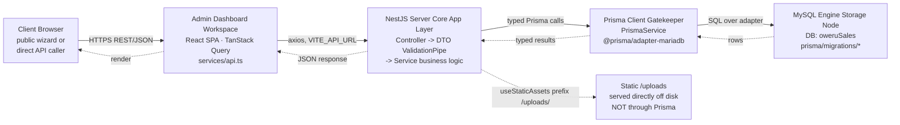
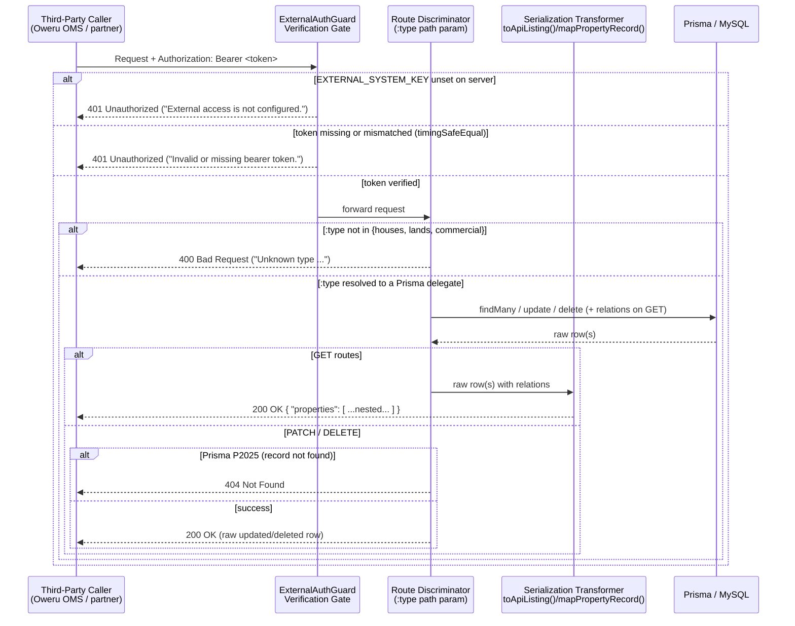
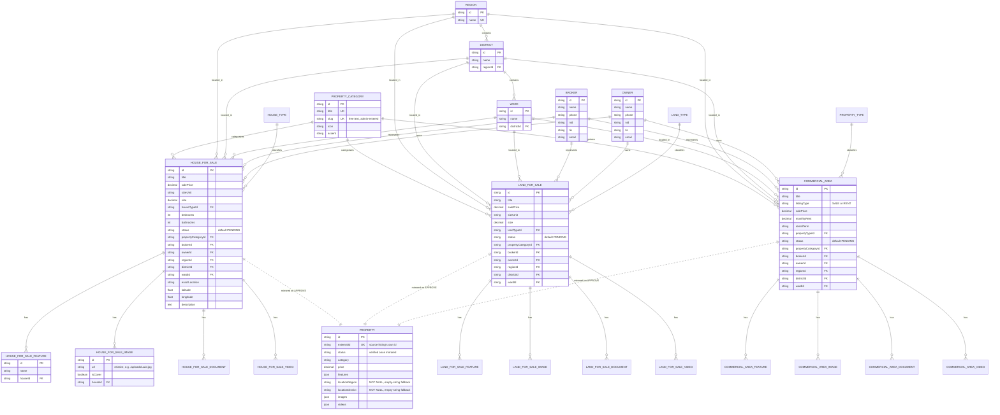
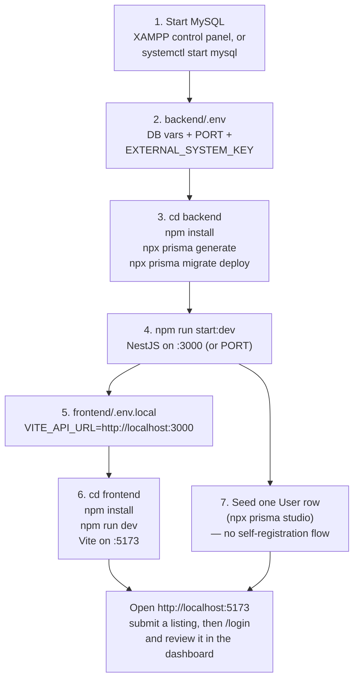

# Sale System with Oweru — Full-Stack Architecture & Engineering Manual

**Audience:** any engineer joining this codebase — frontend, backend, or full-stack. Onboarding,
debugging, extending, or running the whole thing locally for the first time.
**Scope:** the entire monorepo — `backend/` (NestJS + Prisma + MySQL) **and** `frontend/`
(React + Vite SPA) — plus how the two talk to each other and how to run both.
**Status:** describes the system as it is implemented in this repository today. Where the
production ops layer (PM2/aaPanel/XAMPP) is not itself part of this repo, §6 documents standard
operating procedure for that stack rather than a specific file that ships with the code.

> **Read this before anything else — a scope note.** A few items this manual's brief described in
> earlier drafts named target behavior that was **not yet implemented** in the codebase at the
> time. They're called out inline, in bold, at the exact point they diverge, and summarized in
> **Appendix A**. This manual documents what actually runs, not an aspirational version of it — so
> it stays trustworthy the next time someone opens a debugger against it.

---

## Table of Contents

1. [Executive Overview & Business Logic](#1-executive-overview--business-logic)
2. [System Architecture & Flow Diagrams](#2-system-architecture--flow-diagrams)
3. [Database Architecture & Schema Landscape](#3-database-architecture--schema-landscape)
4. [Implementation Matrix & Gateway Endpoints](#4-implementation-matrix--gateway-endpoints)
5. [Security Framework & Integrity Controls](#5-security-framework--integrity-controls)
6. [Deployment Pipeline, PM2 Runtime & Monitoring](#6-deployment-pipeline-pm2-runtime--monitoring)
7. [Frontend Application — Full Developer Guide](#7-frontend-application--full-developer-guide)
8. [Local Development — Running Both Sides](#8-local-development--running-both-sides)
9. [Appendix A — Spec Deltas](#appendix-a--spec-deltas-what-this-manual-would-not-let-pass-silently)

---

## 1. Executive Overview & Business Logic

### 1.1 What this system is

**Sale System with Oweru** is the listing intake and review platform for a Tanzanian real-estate
brand ("Sell With Oweru"). A public React wizard collects property submissions across three
categories — **house for sale**, **land for sale**, **commercial area** (sale or rent) — a NestJS
API validates and stores them, and an operations team reviews, edits, and approves them from an
admin dashboard that is itself part of the same React app.

Once approved, a listing becomes eligible to synchronize outward in two independent directions:

1. **Internally**, into a flattened `Property` mirror table that the platform's own public read
   surface (`GET /properties`) serves.
2. **Externally**, to a corporate partner (Oweru OMS) through a bearer-token-gated B2B gateway
   (`/external/properties`) that reshapes live listing rows into the partner's contract on every
   call — it does not read from the mirror table.

### 1.2 The core boundary rule

> **Data only streams to a downstream consumer once an administrator explicitly transitions a
> listing's `status` to `APPROVE`/`APPROVED` from the workspace dashboard.**

This rule is enforced at exactly one seam: the `update()` method on each of the three listing
services (`HouseForSaleService`, `LandForSaleService`, `CommercialAreaService`). After the
existing Prisma `update()` call resolves — never before, never instead of it — each service
calls:

```ts
await this.propertyMirror.syncApproved(kind, id, updateDto.status);
```

`PropertyMirrorService.syncApproved()` is a **guarded no-op**: it inspects the incoming
`status` value and returns immediately unless it is `APPROVE` or `APPROVED` (case-insensitive).
No other code path — not `create()`, not a document/image upload, not a PATCH that leaves
`status` untouched — can trigger the mirror write. This is deliberate: the boundary is a single
`if` statement in a single method, not a distributed convention that could drift.

The external gateway does **not** independently re-check this rule — it reads whatever the
`status` column currently holds via its own `NOT_DELETED` filter (`status != 'DELETED'`). This
means the external feed's visibility rule is "not deleted," not "approved." See §4.3 and
Appendix A.

---

## 2. System Architecture & Flow Diagrams

### 2.1 Primary request path — dashboard & public site



- **Client → Dashboard**: `axios`-based `services/api.ts`, base URL from `VITE_API_URL`
  (falls back to `https://saleapi.oweru.com`). Full frontend detail in §7.
- **Dashboard → NestJS**: plain REST/JSON over HTTPS. No GraphQL, no gRPC layer.
- **NestJS App Layer**: each resource is its own Nest module
  (`house-for-sale`, `land-for-sale`, `commercial-area`, `brokers`, `owners`,
  `property-categories`, `regions`, `districts`, `wards`, `uploads`, `dashboard`, `auth`,
  `users`, `property-mirror`, `properties`, `external`). A global `ValidationPipe` (see §5.2) and
  a global `AllExceptionsFilter` (`src/common/all-exceptions.filter.ts`) wrap every request.
- **Prisma Client Gatekeeper**: `PrismaService` (`src/prisma.config/prisma.service.ts`) extends
  `PrismaClient`, constructed with `@prisma/adapter-mariadb` using **discrete** `DATABASE_HOST` /
  `DATABASE_PORT` / `DATABASE_USER` / `DATABASE_PASSWORD` / `DATABASE_NAME` env vars (not a
  single connection-string parse) — `PrismaModule` is `@Global()`, so every feature module gets
  `PrismaService` injected without re-importing it.
- **MySQL Engine Storage Node**: schema is Prisma-migration-driven (`prisma/migrations/*`), one
  physical database (`oweruSales` locally per `backend/.env`, environment-specific in
  production).
- **Static media**: `app.useStaticAssets(join(process.cwd(), 'uploads'), { prefix: '/uploads/' })`
  in `main.ts` — uploaded files are served directly off disk under `/uploads/<filename>`, not
  streamed through Prisma.

### 2.2 B2B interconnect flow — `/external/properties`



1. **Verification Gate** — `ExternalAuthGuard` (`src/external/external-auth.guard.ts`) runs
   before the controller method is ever invoked (`@UseGuards(ExternalAuthGuard)` at the
   controller class level, so it applies uniformly to all four routes). Failure short-circuits
   the request with a `401`; the controller/service layer never runs.
2. **Route Discriminator** — `ExternalPropertiesController` binds `:type` as a plain string path
   param; `ExternalPropertiesService.resolveType()`/`delegateFor()` is the single place that maps
   it to a Prisma delegate (`houseForSale`, `landForSale`, `commercialArea`). An unrecognized
   `:type` throws `BadRequestException` here — before any query runs.
3. **Serialization Transformer** — for the two `GET` routes, `toApiListing()`
   (`external-properties.service.ts`) reshapes the raw Prisma row (with its relations already
   `include`d) into the partner's nested JSON contract. `PATCH`/`DELETE` do **not** run this
   transform — they return the raw Prisma row (see §4.3 and Appendix A on the "dual pipeline").
4. **Response Delivery** — every list-returning route wraps its array in a `{ "properties": [...] }`
   root object, per the partner's schema requirement.

### 2.3 Use-case / workflow matrix

| Use case | Trigger | Path | Guard rail |
|---|---|---|---|
| **Public listing submission** | Visitor completes the wizard | `POST /house-for-sale`, `/land-for-sale`, `/commercial-area` | Global `ValidationPipe`; nested `create` (broker/owner/features/images/documents/videos) in one Prisma call; `status` defaults to `PENDING` |
| **Admin review — edit** | Reviewer opens a listing in the dashboard | `GET /:kind/:id` (with relations), then `PATCH /:kind/:id` | Same DTOs as create, `PartialType`-derived |
| **Admin review — approve** | Reviewer sets status to `APPROVE` and saves | `PATCH /:kind/:id` with `{ status: "APPROVE" }` | Triggers `PropertyMirrorService.syncApproved()` — see §1.2 |
| **Admin review — delete** | Reviewer deletes a listing from the dashboard | `DELETE /:kind/:id` | Hard delete via `prisma.<model>.delete()` — this is the **internal** admin delete, separate from the external gateway's delete |
| **Partner — combined feed** | Partner polls for everything | `GET /external/properties` | `Promise.all` across all three tables, `status != DELETED`, bearer-gated |
| **Partner — one category** | Partner polls one listing type | `GET /external/properties/:type` | Same filter, single-table `include` set |
| **Partner — dynamic update** | Partner PATCHes a field set | `PATCH /external/properties/:type/:id` | Whitelisted `UpdateExternalListingDto` fields only (§5.2); `P2025` → `404` |
| **Partner — safe hard-delete** | Partner deletes a record | `DELETE /external/properties/:type/:id` | **Permanent** row removal (`prisma.<model>.delete()`), not a status flip; `P2025` → `404` |

---

## 3. Database Architecture & Schema Landscape

### 3.1 Primary tracking tables

Each listing category is its **own top-level table** — there is no single polymorphic `Listing`
table with a discriminator column. This is a deliberate schema choice: house/land/commercial
listings have genuinely different column sets (bedrooms vs. land type vs. rental term), and
Prisma's relation model handles three narrow tables more cleanly than one wide one with dozens of
nullable columns.



> The `LandForSale*`/`CommercialArea*` feature/image/document/video tables (shown above only as
> relationship edges, to keep the diagram legible) mirror `HouseForSaleFeature`/`HouseForSaleImage`
> field-for-field, with `landId`/`commercialId` in place of `houseId`.

| Table | Purpose | Notable fields |
|---|---|---|
| `HouseForSale` | One row per house listing | `salePrice`, `sizeUnit`, `size`, `houseTypeId`, `bedrooms`, `bathrooms`, `status` (default `PENDING`) |
| `LandForSale` | One row per land listing | `salePrice`, `sizeUnit`, `size`, `landTypeId`, `status` |
| `CommercialArea` | One row per commercial listing | `listingType` (`SALE`/`RENT`), `salePrice`, `monthlyRent`, `rentalTerm`, `propertyTypeId`, `status` |
| `PropertyCategory` | Admin-managed category metadata | `title`, `slug`, `icon`, `accent` — **`slug` is free text the admin types in the Categories screen, not a fixed enum** |
| `Region` / `District` / `Ward` | Tanzania location hierarchy | `Ward.districtId → District.id`, `District.regionId → Region.id`, unique on `(name, parent)` |
| `Broker` / `Owner` | Shared contact directory | `name`, `phone`, `nid`, `tin`, `email` — reused across every listing they're attached to; **no region/district field of their own** |

Each listing table additionally has its own **feature / image / document / video** child tables
(e.g. `HouseForSaleFeature`, `HouseForSaleImage`, `HouseForSaleDocument`, `HouseForSaleVideo`,
mirrored for `LandForSale*` and `CommercialArea*`). All are `onDelete: Cascade` from the parent —
deleting a listing row deletes its features/media rows automatically; it does **not** delete the
physical files under `uploads/`.

### 3.2 The `Property` mirror table — internal staging zone

```prisma
model Property {
  id               String   @id @default(uuid())
  externalId       String   @unique   // = source listing's own id
  status           String             // "verified" once mirrored
  title            String
  category         String             // propertyCategory.slug, or a synthesized fallback
  price            Decimal
  ... (fully flattened: houseType, landType, commercialType, bedrooms, bathrooms,
       sizeValue/sizeUnit/sizeWidth/sizeLength, features Json, locationRegion/
       locationDistrict/locationWard/locationStreet/locationGpsLat/locationGpsLng,
       ownerFullName/ownerPhone/..., brokerFullName/brokerPhone/...,
       images Json, videos Json, listingKind, parentExternalId, unitLabel)
  createdAt        DateTime @default(now())
  updatedAt        DateTime @updatedAt

  @@map("Properties")
}
```

This table is **write-only from `PropertyMirrorService`** and **read-only from
`PropertiesService`** (`GET /properties`). Nothing else touches it. It exists so the platform's
own public read surface never has to join across three source tables and their relations on
every request — the mirror is the pre-joined, pre-flattened snapshot taken at approval time.

**Two NOT NULL columns worth knowing about:** `locationRegion` and `locationDistrict` are
non-nullable in the `Properties` table, but a source listing's region/district relation is
optional. `PropertyMirrorService` falls back to `''` (empty string) rather than `null` when
building the mirror row — this is a schema/data mismatch that was resolved with a safe fallback
rather than a migration, documented at the call site.

### 3.3 Relational constraint notes

- `HouseForSaleFeature.houseId`, `LandForSaleFeature.landId`, `CommercialAreaFeature.commercialId`
  — each feature is a bare `{ id, name }` row, **not** a shared lookup table. Two listings with a
  "Parking" feature each get their own `Feature` row with the string `"Parking"`. There is no
  feature dictionary/enum in the schema today (see Appendix A re: the `{key, label}` object
  format).
- Media tables (`*Image`, `*Document`, `*Video`) store a `url` (relative, e.g. `/uploads/<uuid>.jpg`),
  optional `fileType`/`sizeBytes`, and — for images — `isCover: Boolean @default(false)`.
  **The stored `url` is always relative.** Absolute-URL composition happens at the read edge:
  the frontend's `getUploadUrl()` (`frontend/src/services/api.ts`, §7.4) prefixes with
  `VITE_API_URL`/`https://saleapi.oweru.com`; the external gateway prefixes with its own
  `MEDIA_BASE_URL` constant (`https://saleapi.oweru.com`, overridable via
  `PUBLIC_MEDIA_BASE_URL`). **These two prefixing points must be kept in sync** — a previous
  regression had the external gateway hardcoded to the wrong host (`oweru.com` instead of
  `saleapi.oweru.com`) precisely because this composition happens in two places, not one.
- `Region`/`District`/`Ward` are seeded from a bundled Tanzania dataset
  (`frontend/src/data/tanzaniaLocations.ts`, §7.2) for offline-first dropdown rendering, and
  reconciled against live DB rows once the backend has locations seeded
  (`prisma/seed-locations.cjs`).

---

## 4. Implementation Matrix & Gateway Endpoints

### 4.1 Mount point and routing

`ExternalPropertiesController` is `@Controller('external/properties')`, registered through
`ExternalPropertiesModule` in `AppModule`. It is **intentionally not mounted at bare
`/properties`** — that path already serves the internal `Property` mirror feed (§3.2) in a
different, flattened response shape. Colliding the two was considered and rejected during
implementation specifically to avoid one route silently changing meaning for existing callers.

| Method | Path | Auth | Body |
|---|---|---|---|
| `GET` | `/external/properties` | Bearer | — |
| `GET` | `/external/properties/:type` | Bearer | — |
| `PATCH` | `/external/properties/:type/:id` | Bearer | `UpdateExternalListingDto` |
| `DELETE` | `/external/properties/:type/:id` | Bearer | — |

### 4.2 The `:type` discriminator

```ts
export type ListingType = 'houses' | 'lands' | 'commercial';

const DELEGATE_KEY: Record<ListingType, 'houseForSale' | 'landForSale' | 'commercialArea'> = {
  houses: 'houseForSale',
  lands: 'landForSale',
  commercial: 'commercialArea',
};
```

`resolveType()` is a closed match against exactly these three literals — there is no
case-insensitivity, no plural/singular normalization, no alias table. `"House"`, `"house"`, and
`"HOUSES"` all fall through to `BadRequestException('Unknown type "..."'`. This is intentional:
the discriminator is also the contract the partner integrates against, and a permissive matcher
would let a typo silently succeed against the wrong table in a future refactor.

Each type carries its **own `include` map** (`INCLUDE[kind]` / `includeFor()`), because the
three Prisma models relate to different type-lookup tables:

| Type | Type-lookup relation | Category-specific transform fields |
|---|---|---|
| `houses` | `houseType` | `houseType` (lowercased), `bedrooms`, `bathrooms` |
| `lands` | `landType` | `landType` (lowercased) |
| `commercial` | `propertyType` | `commercialType` (lowercased, from `propertyType.name`), `rentMonths` (parsed from `rentalTerm` when `listingType === 'RENT'`) |

### 4.3 The serialization pipeline — and where it is *not* dual

The brief describes a "Dual-Pipeline Data Serialization Engine" that splits payloads into
separate **brokerage** (houses/commercial) and **land** tracks. **That split does not exist in
the current implementation.** What exists is a single transform function
(`toApiListing()`/`mapPropertyRecord()`) applied identically across all three types, with three
small `if (kind === '...')` branches at the end that attach the one or two fields unique to that
type (`houseType`+`bedrooms`+`bathrooms`, or `landType`, or `commercialType`+`rentMonths`).
`owner` and `broker` are built the same way, from the same shape, for every type — there is no
type-conditional "brokerage track."

What the current pipeline *does* do, concretely, per row:

1. Resolves `category` from `propertyCategory.slug` (dashes → underscores, lowercased), falling
   back to a synthesized `house_sale` / `land_sale` / `commercial_sale` / `commercial_rent` when
   no category is linked.
2. Converts every Prisma `Decimal` field (`price`, `size`, `latitude`/`longitude` where numeric)
   to a plain JS `number` via a `toNumber()` helper — never leaves a `Decimal` object in the
   response, which would otherwise serialize inconsistently.
3. Nests `size` → `{ value, unit }`, `location` → `{ region, district, ward, street, gpsLat, gpsLng }`,
   `owner` → `{ fullName, phone, altPhone, email, nationalId, tin }`, `broker` → the same shape
   plus `operatingRegion`/`operatingDistrict` (sourced from the *listing's* region/district, since
   `Broker` carries no region of its own — see §3.1).
4. Maps `features` (`[{ name: 'Parking' }]`) to a flat, lowercased string array
   (`["parking"]`) — **not** to `{ key, label }` objects. See Appendix A.
5. Prefixes every `images[]`/`videos[]` entry with `MEDIA_BASE_URL` (§3.3).
6. **Does not strip `owner`/`broker`** — both are fully populated in the response today, by
   explicit prior instruction ("map ALL fields, do not hide anything"). See Appendix A.

`PATCH` and `DELETE` do not run this transform at all — they return whatever Prisma's
`update()`/`delete()` resolves with (the raw row, relations not included), since the partner's
contract for those two operations is "confirm what changed," not "give me the full nested
listing again."

---

## 5. Security Framework & Integrity Controls

### 5.1 `ExternalAuthGuard` — fail-closed bearer verification

`src/external/external-auth.guard.ts`, applied at the controller level so it runs ahead of every
handler in `ExternalPropertiesController`:

```ts
canActivate(context: ExecutionContext): boolean {
  const request = context.switchToHttp().getRequest<Request>();
  const expected = process.env.EXTERNAL_SYSTEM_KEY;

  if (!expected) {
    this.logger.error('EXTERNAL_SYSTEM_KEY is not set — refusing all external requests.');
    throw new UnauthorizedException('External access is not configured.');
  }

  const token = extractBearerToken(request.headers['authorization']);
  if (!token || !safeEquals(token, expected)) {
    throw new UnauthorizedException('Invalid or missing bearer token.');
  }
  return true;
}
```

**Fallback structure when the env key is missing:** the guard does **not** treat an unset
`EXTERNAL_SYSTEM_KEY` as "no restriction configured, allow through." It treats it as a
misconfiguration and throws the exact same `401 Unauthorized` a bad token would produce, with a
distinct server-side log line (`EXTERNAL_SYSTEM_KEY is not set — refusing all external requests.`)
so an operator can tell the two failure modes apart from the logs without the client-visible
response ever leaking which one occurred.

**Timing-safe comparison:**

```ts
function safeEquals(a: string, b: string): boolean {
  const bufA = Buffer.from(a);
  const bufB = Buffer.from(b);
  if (bufA.length !== bufB.length) return false;
  return timingSafeEqual(bufA, bufB);
}
```

`crypto.timingSafeEqual()` only accepts equal-length buffers — comparing unequal lengths throws,
so the length check happens first and short-circuits with a plain `false`. This means the
length-mismatch branch is **not** itself constant-time relative to the length-match branch, but
token *length* is not the secret being protected — the token's *content* is, and every
content comparison that reaches `timingSafeEqual()` is genuinely constant-time regardless of
where the first differing byte falls. This is the standard, correct scope for this mitigation:
it defeats a byte-by-byte content-guessing attack, which is the realistic threat against a bearer
token compare.

### 5.2 Global `ValidationPipe` vs. loose PATCH payloads

`main.ts`: `app.useGlobalPipes(new ValidationPipe({ whitelist: true, transform: true }))`. With
`whitelist: true`, class-validator strips any property from an incoming body **that has no
validation decorator on the target DTO class** — this applies before the request even reaches the
controller method, regardless of what the controller does afterward.

This bit the external gateway once already: an earlier version of `UpdateExternalListingDto` had
plain, undecorated TypeScript properties (`title?: string`, etc., with a `[key: string]: unknown`
index signature for documentation purposes). TypeScript's index signature has **zero runtime
effect** on class-transformer/class-validator — the global pipe still stripped the body down to
`{}` before it reached Prisma, so `PATCH` requests returned `200 OK` while silently changing
nothing. The fix was **not** a per-route pipe override (a param-scoped `ValidationPipe` still runs
*after* the global one in the pipe chain, receiving the already-stripped value — that override was
dead code). The fix was decorating every field the DTO is meant to carry:

```ts
export class UpdateExternalListingDto {
  @IsOptional() @IsString()  title?: string;
  @IsOptional() @IsString()  status?: string;
  @IsOptional() @IsNumber()  salePrice?: number;
  @IsOptional() @IsNumber()  monthlyRent?: number;
  @IsOptional() @IsString()  rentalTerm?: string;
  @IsOptional() @IsNumber()  size?: number;
  @IsOptional() @IsString()  sizeUnit?: string;
  @IsOptional() @IsString()  description?: string;
}
```

**Operational consequence, worth repeating to every engineer who touches this DTO:** any field
not decorated here is silently dropped from every `PATCH /external/properties/:type/:id` request,
with **no error, no warning, a `200 OK` response** — the exact failure mode above. Adding partner
support for a new field (e.g. `bedrooms`, `latitude`) requires adding a decorated property to this
DTO; there is no other switch to flip.

A field the DTO *does* whitelist but the target Prisma model doesn't have (e.g. `monthlyRent`
against `HouseForSale`) reaches Prisma successfully and is rejected there with a runtime error,
which the service layer catches and reports as `400 Bad Request` — a legibly different failure
mode from the silent-drop one above.

---

## 6. Deployment Pipeline, PM2 Runtime Orchestration & Monitoring

> This section documents standard operating procedure for this stack combination (aaPanel + PM2
> + Linux, with local development against XAMPP's MySQL). None of these files ship inside this
> repository — `ecosystem.config.js`, aaPanel site configuration, and PM2 process names are
> environment-specific and owned by whoever provisions the box. Treat file paths below as the
> conventional aaPanel/PM2 layout, and confirm against the actual server before relying on them.
> This section covers the **backend** only — the frontend deploys as a static bundle; see §7.9.

### 6.1 Local development — XAMPP

- Local `backend/.env` points `DATABASE_HOST=127.0.0.1`, `DATABASE_PORT=3306` at XAMPP's MySQL
  (or MariaDB) service, with `DATABASE_URL` kept in sync with the discrete host/port/user/password
  vars — `PrismaService` reads the discrete vars for the adapter constructor, so **both must be
  updated together** when rotating a local password; only the discrete vars are actually consumed
  at runtime (`DATABASE_URL` is present for tooling — e.g. `prisma migrate` — that expects it).
- Run: `npm install && npx prisma generate && npm run start:dev` (from `backend/`). `start:dev`
  runs `nest start --watch`.
- Common local failure: **port 3306 already bound** — either a system MySQL service is also
  running, or a previous XAMPP session didn't release the port. Check with:
  `sudo lsof -i :3306` or `sudo netstat -tulpn | grep 3306` (see §6.4 on missing `net-tools`).

### 6.2 Production — aaPanel + PM2

Typical aaPanel layout for a Node site:

```
/www/wwwroot/<site>/               # deployed backend checkout
  ├── dist/main.js                 # `npm run build` output — this is what PM2 runs
  ├── .env                         # production secrets — set outside git, via aaPanel's file manager
  ├── uploads/                     # persisted media — back this up independently of the DB
  └── node_modules/
```

Standard deploy sequence:

```bash
cd /www/wwwroot/<site>
git pull                     # or aaPanel's own deployment hook
npm install --omit=dev
npx prisma generate
npx prisma migrate deploy    # NOT `migrate dev` in production — no interactive prompts, no shadow DB
npm run build
pm2 restart <process-name> --update-env
```

**`--update-env` is not optional after touching `.env`.** PM2 caches the environment a process
was originally started with; a plain `pm2 restart` re-execs the process but keeps the *old*
environment snapshot, so a rotated `EXTERNAL_SYSTEM_KEY` or a changed `DATABASE_PASSWORD` will
silently keep applying the previous value until either `--update-env` is used or the process is
fully `pm2 delete`'d and re-`pm2 start`'d. This is the single most common cause of "I updated the
`.env` and nothing changed" reports against this system.

```bash
pm2 restart all --update-env      # flushes cached env for every managed process
pm2 restart <process-name> --update-env   # scoped to one process — prefer this in a multi-app box
pm2 logs <process-name> --lines 200       # tail recent output
pm2 describe <process-name>               # confirm the env it actually launched with
```

aaPanel's Node.js Project Manager panel wraps `pm2` for point-and-click start/stop/restart and
log viewing — the underlying commands above are what it executes, and dropping to the shell for
`--update-env` specifically is often faster than the panel UI for that one flag.

### 6.3 Monitoring playbook — connection drops

1. **`ECONNREFUSED` / `P1001` (Prisma "Can't reach database server")** — confirm MySQL is up
   (`systemctl status mysql` / aaPanel's Database panel), confirm `DATABASE_HOST`/`DATABASE_PORT`
   in the *running* process's environment match reality (`pm2 describe <process-name>` — see
   §6.2 on stale cached env), confirm the DB user's host grants allow the app server's IP if the
   two are on different machines.
2. **`P2025` — "An operation failed because it depends on one or more records that were
   required but not found"** — this is Prisma's not-found code, surfaced deliberately by this
   codebase's `isRecordNotFound()` helper (present in every listing service, the mirror service,
   and the external gateway service) and converted to a `404 NotFoundException` rather than a raw
   `500`. If a `P2025` reaches the logs as an *unhandled* rejection instead of a clean 404, the
   catch block around that specific Prisma call is missing — check that the new/changed code path
   follows the existing `try { ... } catch (error) { if (isRecordNotFound(error)) throw new
   NotFoundException(...); throw new BadRequestException(...); }` pattern before shipping it.
3. **Local XAMPP port locks** — see §6.1. In production this manifests as PM2 restart-looping a
   process that can't bind or connect; `pm2 logs` will show the same connection error repeating
   on a fixed interval matching PM2's restart backoff.
4. **Missing `net-tools` (`netstat: command not found`)** — common on minimal Linux images;
   aaPanel-provisioned boxes usually include it, but a hardened/stripped image may not.
   `sudo apt install net-tools` (Debian/Ubuntu) or `sudo yum install net-tools` (CentOS/RHEL)
   restores `netstat`; `ss -tulpn` is the modern equivalent and ships by default on most distros
   if `net-tools` is unavailable.
5. **Runtime thread/memory limits** — PM2 processes should run with an explicit memory ceiling
   (`pm2 start dist/main.js --name <process-name> --max-memory-restart 512M`, or the equivalent
   `max_memory_restart` key in `ecosystem.config.js`) so a leak restarts the process instead of
   taking down the host. `pm2 monit` gives a live per-process CPU/memory view; `pm2 describe
   <process-name>` reports restart count and the reason for the last restart (`exited`,
   `error`, or the memory ceiling itself).

---

## 7. Frontend Application — Full Developer Guide

### 7.1 Stack

| Concern | Choice |
|---|---|
| Framework | React 18.3 + TypeScript 5.5 |
| Build tool / dev server | Vite 5.4 (`npm run dev` / `npm run build`) |
| Server-state cache | TanStack Query 5 (`@tanstack/react-query`) |
| Routing | React Router 6 (`react-router-dom`), client-side only (`BrowserRouter`) |
| Base UI kit | Bootstrap 5.3 + Bootstrap Icons, layered under a custom design system |
| Custom design system | `src/styles/oweru.css` — hand-written, brand tokens (navy `#101a35` / gold `#e3a53d`), dashboard layout, tables, modals, and every mobile media query |
| Maps | Leaflet 1.9 (`leaflet`) — pin capture on the public wizard's Location step |
| HTTP client | Axios (`axios`), one shared instance |
| i18n | Hand-rolled context (`src/i18n.tsx`) — English/Kiswahili, no external i18n library |

There is **no** Redux/Zustand/MobX — all client state is component-local `useState`/`useEffect`;
all server state goes through TanStack Query.

### 7.2 Directory map (`frontend/src/`)

```
src/
├── App.tsx                    # <BrowserRouter> + <Routes> — the entire route table (§7.3)
├── main.tsx                   # ReactDOM root, QueryClientProvider, global CSS imports
├── i18n.tsx                   # LanguageProvider + useLanguage() — English/Kiswahili
├── types.ts                   # CategoryId, DetailsData union, LocationData, PersonDetails, ...
├── vite-env.d.ts              # Vite/TS ambient types (import.meta.env typing)
├── hooks/
│   └── useIsMobile.ts         # matchMedia(720px) hook — mirrors oweru.css's mobile breakpoint
├── services/
│   └── api.ts                 # single Axios instance + every typed API namespace (§7.4)
├── data/
│   ├── tanzaniaLocations.ts   # bundled offline region/district/ward dataset
│   └── tanzania-locations.json
├── styles/
│   └── oweru.css              # the whole custom design system — see §7.1
└── components/
    ├── pages/
    │   ├── HomePage.tsx           # public listing wizard (route "/") — §7.5
    │   ├── LoginPage.tsx          # workspace sign-in (route "/login")
    │   └── dashboard/
    │       └── Dashboard.tsx      # admin workspace (route "/Dashboard") — §7.6
    ├── steps/
    │   ├── DetailsStep.tsx        # also exports BrokerOwnerStep, FeaturesStep (same file)
    │   ├── LocationImagesStep.tsx # dual mode: "location" | "images"; mobile sub-paging
    │   └── ReviewStep.tsx         # final review before submit
    └── shared/
        ├── CategoryGrid.tsx       # category picker tiles (house/land/commercial)
        ├── LocationForm.tsx       # region/district/ward cascading selects
        ├── Navbar.tsx              # public-site top nav
        ├── ResponsiveSelect.tsx    # the custom dropdown primitive used everywhere
        └── Stepper.tsx             # wizard progress indicator (desktop sidebar)
```

### 7.3 Routing table (`App.tsx`)

```tsx
<Routes>
  <Route path="/" element={<HomePage />} />
  <Route path="/login" element={<LoginPage />} />
  <Route path="/Dashboard" element={<ProtectedDashboard />} />
  <Route path="*" element={<Navigate to="/" replace />} />
</Routes>
```

`ProtectedDashboard` is a tiny inline wrapper: `localStorage.getItem('oweru-auth-user') ?
<Dashboard /> : <Navigate to="/login" replace />`. There is **no token refresh, no server-side
session check on route entry** — the gate is purely "is there a cached user object in
`localStorage`." A backend-issued 401 on a dashboard API call does not automatically redirect to
`/login`; the stale `localStorage` entry keeps the route open until it's manually cleared (e.g.
via the dashboard's own Logout button, which calls `localStorage.removeItem('oweru-auth-user')`).

### 7.4 Data layer — `services/api.ts`

```ts
const API_BASE_URL = import.meta.env.VITE_API_URL || 'https://saleapi.oweru.com'
export const getUploadUrl = (url: string) => new URL(url, `${API_BASE_URL}/`).toString()

const api = axios.create({ baseURL: API_BASE_URL, headers: { 'Content-Type': 'application/json' } })

export const uploadApi = { upload: ... }          // multipart POST /uploads
export const houseForSaleApi = { ... }             // CRUD + getHouseTypes lookup
export const landForSaleApi = { ... }
export const commercialAreaApi = { ... }
export const lookupApi = { ... }                   // regions/districts/wards/land-types/property-types
export const authApi = { ... }                     // POST /auth/login
export default api                                 // raw instance, used directly by Dashboard.tsx
```

**Every network call in the app goes through this one file** — no component calls `fetch()`
directly, with exactly one deliberate exception: `LocationImagesStep.tsx`'s address search calls
the public OpenStreetMap Nominatim API directly (it is not our backend, and routing it through
`api.ts`'s `baseURL` would be wrong).

`getUploadUrl()` is the frontend half of the absolute-media-URL story from §3.3 — it must be kept
conceptually in sync with the backend's `MEDIA_BASE_URL` constant in
`external-properties.service.ts`. They are two independent constants today, not one shared source
of truth; a host change has to be made in both places.

### 7.5 The public listing wizard (`HomePage.tsx`)

A single-page step machine, `step: 0–5`:

| Step | Component | Content |
|---|---|---|
| 0 | `DetailsStep` | Title, price, size, category-specific type picker |
| 1 | `FeaturesStep` | Amenity checkboxes (from `DetailsStep.tsx`) |
| 2 | `BrokerOwnerStep` | Broker + owner contact capture (from `DetailsStep.tsx`) |
| 3 | `LocationImagesStep mode="location"` | Region/district/ward + map pin + description |
| 4 | `LocationImagesStep mode="images"` | Photos, one video, documents |
| 5 | `ReviewStep` | Read-only summary before submit |

**Mobile sub-paging:** on narrow viewports (`useIsMobile()`, 720px), steps 0 and 3 further split
into two screens each via a local `subStep: 0 | 1` — driven by the *same* Continue/Back buttons,
with no new UI and no change to the `Stepper` sidebar (`currentStep` is unaffected by `subStep`).
This exists purely so the details/location forms don't get too tall on a phone; see `HomePage.tsx`
for the exact gate logic (`stepHasMobileSub`, `mobilePageFor`).

**Submit flow (`handleSubmit`)**: uploads images/documents in parallel via `uploadApi.upload()`
(the video, if any, was already uploaded during step 4 as the user picked it — not deferred to
submit time), then `POST`s a single nested payload — broker, owner, features, images, documents,
videos all created in one Prisma call server-side — to whichever of `/house-for-sale`,
`/land-for-sale`, `/commercial-area` matches the chosen category. New listings always start at
`status: "PENDING"`.

### 7.6 The admin dashboard (`Dashboard.tsx`)

Four sections behind the `/Dashboard` route: **Overview**, **Listings**, **People**,
**Categories**. Selected implementation details worth knowing before touching this file:

- **Auth/role gate**: `authUser.role` (`ADMIN` / `DIRECTOR` / `MARKETER`) read straight out of the
  cached `localStorage` user object — `MARKETER` hides the Categories section; there is no
  server-side re-check of role on each dashboard action, only on whatever the backend endpoint
  itself enforces.
- **Pagination**: fixed page size of 9 rows, computed client-side after the full list is fetched
  (`useQuery` pulls everything; there is no server-side `?page=`/`?limit=` param today).
- **Custom dropdown**: every `<select>`-like control in the dashboard is the
  `oweru-location-select` pattern (a `<button>` + absolutely-positioned option list styled in
  `oweru.css`), **not** a native `<select>` — this was a deliberate mobile-rendering fix; native
  selects were replaced one at a time across the toolbar filters, the edit-listing status field,
  and the "Add listing" modal.
- **Delete confirmation**: a custom `ConfirmModal` component replaces `window.confirm()`
  everywhere in the dashboard, centered and themed to match the rest of the UI.
- **Mobile layout**: the sidebar/header becomes `position: sticky` and its live-measured height is
  published to a CSS custom property (`--admin-topbar-h`, set via a `ResizeObserver` in
  `Dashboard.tsx`) so modals can size themselves to "the space below the header" instead of the
  full viewport; data tables hide secondary columns under a breakpoint rather than scrolling
  horizontally.

### 7.7 Internationalization (`i18n.tsx`)

`LanguageProvider` wraps the entire router in `App.tsx`; `useLanguage()` exposes `{ language,
setLanguage, tr }` and **throws** if called outside the provider (`useLanguage must be used
within LanguageProvider`) — every component that calls it must sit under `App.tsx`'s tree, which
in practice means "every component," since the provider is mounted once at the very top. `tr()` is
a plain lookup-table translation helper (no ICU pluralization, no lazy-loaded locale bundles) used
throughout the wizard's labels and its auto-generated property description.

### 7.8 Environment variables (frontend)

| Var | Effect | Default when unset |
|---|---|---|
| `VITE_API_URL` | Base URL every `services/api.ts` call and `getUploadUrl()` resolve against | `https://saleapi.oweru.com` (the **live production API**) |

Only variables prefixed `VITE_` are exposed to client code via `import.meta.env` (Vite's own
convention — this is not project-specific configuration). There is no committed `.env`/`.env.example`
in `frontend/` today; create `frontend/.env.local` (git-ignored by Vite's default ignore patterns)
to point a local dev server at a local backend:

```dotenv
# frontend/.env.local
VITE_API_URL=http://localhost:3000
```

**Without this file, `npm run dev` talks to the live production backend by default** — worth
saying plainly, since it's the single easiest way to accidentally create test data in production
or, worse, exercise the external gateway's hard-delete against real rows.

### 7.9 Build & run commands

```bash
cd frontend
npm install
npm run dev        # Vite dev server, default http://localhost:5173, HMR on
npm run build       # tsc -b (typecheck) && vite build  ->  frontend/dist/ (static bundle)
npm run preview     # serves the built dist/ locally, for a pre-deploy sanity check
```

`dist/` is a plain static SPA bundle — deployable to any static host or behind nginx/aaPanel's
static-site serving. Because routing is client-side (`BrowserRouter`), **the host must rewrite
every unmatched path back to `index.html`** — a direct hit on `/Dashboard` against a naive static
file server 404s without that fallback rule, even though the same URL works fine when reached by
clicking a link inside the already-loaded app.

### 7.10 Common frontend pitfalls

1. **Silent prod fallback** — see §7.8. No `VITE_API_URL` means no error, just quiet traffic
   against `https://saleapi.oweru.com`.
2. **`getUploadUrl()` / `MEDIA_BASE_URL` drift** — see §3.3 and §7.4. Two independent constants,
   one conceptual contract.
3. **`useIsMobile`'s breakpoint (720px) vs. `oweru.css`'s media queries** — both are hand-maintained
   at `max-width: 720px` independently. Changing one without the other desyncs the wizard's
   JS-driven mobile sub-paging (§7.5) from the CSS layout it's paging around.
4. **`whitelist: true` on the backend applies to every POST/PATCH the frontend sends, too** — see
   §5.2. A new form field added to a step component does nothing server-side until the matching
   backend DTO is also updated to accept it; this is the same failure class that bit the external
   gateway, just reachable from the public wizard/dashboard forms as well.

---

## 8. Local Development — Running Both Sides

No monorepo task-runner (no Turborepo/Nx/`concurrently` at the repo root) ties the two apps
together — `backend/` and `frontend/` are two independent `npm` projects, each run from its own
terminal, in its own directory. Order matters the first time; after that, either can be
started/stopped independently.



Step by step, with the exact commands:

1. **Start MySQL.** XAMPP's control panel on a dev machine, or `sudo systemctl start mysql` /
   `mysqld` on a Linux box without XAMPP. Confirm the port matches `DATABASE_PORT` below (default
   `3306`).
2. **Configure `backend/.env`.** No `.env.example` ships in this repo — create the file directly
   with (at minimum): `DATABASE_URL`, `DATABASE_HOST`, `DATABASE_PORT`, `DATABASE_USER`,
   `DATABASE_PASSWORD`, `DATABASE_NAME`, `PORT`, and `EXTERNAL_SYSTEM_KEY` (generate with
   `openssl rand -hex 32` — required even locally, since `ExternalAuthGuard` fails closed without
   it; §5.1). Full var list and meaning in §6.1 and §5.1.
3. **Install & migrate the backend:**
   ```bash
   cd backend
   npm install
   npx prisma generate
   npx prisma migrate deploy   # or `migrate dev` locally if you're actively changing schema.prisma
   ```
4. **Run the backend:** `npm run start:dev` — NestJS listens on `http://localhost:<PORT>`
   (`PORT` from `.env`, defaults to `3000` if unset in code via `process.env.PORT ?? 3000`).
5. **Point the frontend at it.** Create `frontend/.env.local`:
   ```dotenv
   VITE_API_URL=http://localhost:3000
   ```
   (Skipping this step is not a hard error — the app still runs, but silently talks to the live
   production API instead; §7.8.)
6. **Install & run the frontend:**
   ```bash
   cd frontend
   npm install
   npm run dev   # http://localhost:5173
   ```
7. **Create a login.** There is no sign-up screen in this codebase — seed a `User` row directly
   (`npx prisma studio` from `backend/`, or a one-off `INSERT`/Prisma script) with a `role` of
   `ADMIN`, `DIRECTOR`, or `MARKETER`.
8. **Verify end-to-end**: open `http://localhost:5173/`, submit a test listing through the public
   wizard, then sign in at `/login` and confirm it appears — `PENDING`, sorted to the top — in the
   dashboard's Listings tab. Set its status to `APPROVE` and confirm `GET
   http://localhost:3000/properties` now includes it (§1.2, §3.2).

---

## Appendix A — Spec Deltas (what this manual would not let pass silently)

Earlier drafts of this manual's brief described three behaviors that **do not exist in the
current codebase**. They're listed here, together, so they can be triaged as a follow-up feature
request rather than discovered later as a documentation lie:

1. **Feature objects.** Brief: `{ "key": "road_access", "label": "Road Access" }`.
   Actual: `features` is a flat array of lowercased strings, e.g. `["road_access"]` is *not*
   produced either — the current transform lowercases and trims the raw `name` verbatim
   (`"Road Access"` → `"road access"`, not `"road_access"`), with no separate `key`/`label` split
   and no underscore-casing step. Implementing the brief's format is a small, contained change to
   `toApiListing()`'s features mapper — flagging it here rather than doing it silently, since it
   changes the external contract's shape.
2. **"Dual-pipeline brokerage/land track split."** Actual: one transform function runs for all
   three types; `owner`/`broker` are built identically regardless of type. There is no
   type-conditional branch that treats houses/commercial differently from land for owner/broker
   purposes.
3. **"Stripping private owner/broker profiles out of client feeds."** Actual: `owner` and
   `broker` are fully populated in every `GET` response from the external gateway today — by
   explicit prior instruction to include every field ("map ALL fields, do not hide anything").
   If the intent has changed and partner responses should now omit or redact PII (phone, email,
   NIDA, TIN), that's a real, separate change to make deliberately — not something to infer from
   a documentation pass.

None of the three are implemented as part of producing this manual. Say which (if any) you want
built, and they can be added as a scoped, testable change with their own changelog entry — same
as the mirror-boundary and PATCH-whitelist fixes documented in §1.2 and §5.2 were.
